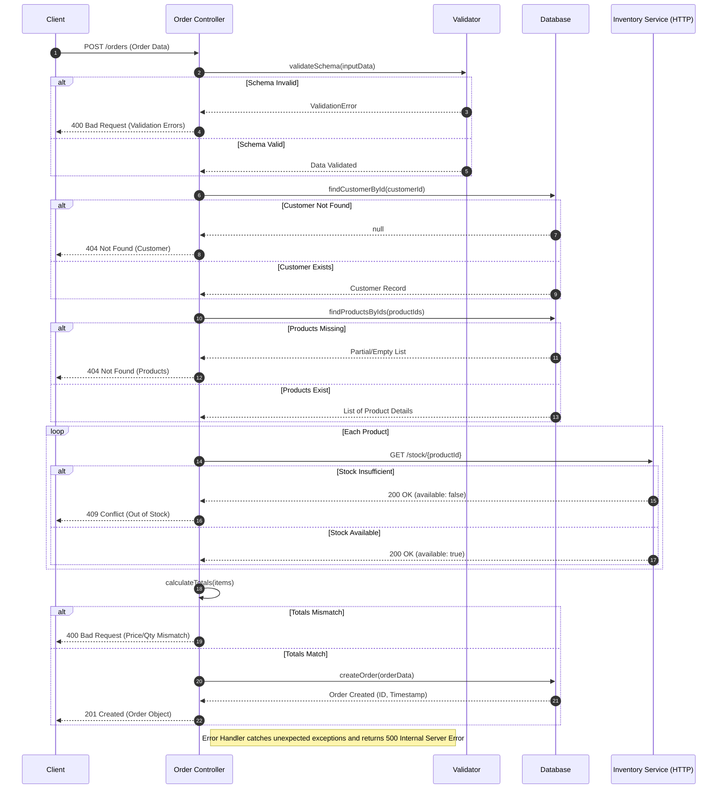

# Create a new order

## API Specification
```
POST /api/orders
Content-Type: application/json
Request body:
{
    "customerId": 1,
    "quantity": 3,
    "totalPrice": 100.0,
    "products": [
        {
            "productId": 1,
            "quantity": 2
        },
        {
            "productId": 2,
            "quantity": 1
        }
    ]
}
```

Response with Success:
```
HTTP/1.1 201 Created
Content-Type: application/json

{
    "orderId": 1,
    "customerId": 1,
    "quantity": 3,
    "totalPrice": 100.0,
    "products": [
        {
            "productId": 1,
            "quantity": 2
        },
        {
            "productId": 2,
            "quantity": 1
        }
    ]
}
```

Response with Bad Request:
```
HTTP/1.1 400 Bad Request
Content-Type: application/json

{
    "error": "Invalid order data"
}
```

Response with error:
```
HTTP/1.1 500 Internal Server Error
Content-Type: application/json

{
    "error": "An unexpected error occurred"
}
```

## Input validation in table format
| Field       | Type    | Required | Description                  |
|-------------|---------|----------|------------------------------|
| customerId  | integer | Yes      | ID of the customer placing the order |
| quantity    | integer | Yes      | Total quantity of products in the order |
| totalPrice  | number  | Yes      | Total price of the order     |
| products    | array   | Yes      | List of products in the order |
| productId   | integer | Yes      | ID of the product            |
| quantity    | integer | Yes      | Quantity of the product      |

## Business validation in table format
| Field       | Validation Rule                  | Description                  |
|-------------|---------------------------------|------------------------------|
| customerId  | Must exist in the customer database | ID of the customer placing the order |
| quantity    | Must be greater than 0           | Total quantity of products in the order |
| totalPrice  | Must be greater than 0           | Total price of the order     |
| products    | Must not be empty                | List of products in the order |
| productId   | Must exist in the product database | ID of the product            |
| quantity    | Must be greater than 0           | Quantity of the product      |

## Business flow
1. Validate the input data.
2. Check if the customer exists in the database.
3. Check if the products exist in the database.
4. Check stock availability for each product from Inventory API via HTTP request.
5. Calculate the total quantity and total price and validate them against the input data.
6. Create a new order record in the database.
7. Return the created order with a 201 status code.
8. Handle any errors and return appropriate error responses.
9. Return an error if the validation fails.

Diagram


## Database to store orders

Table : orders
| Field       | Type    | Description                  |
|-------------|---------|------------------------------|
| orderId     | integer | ID of the order              |
| customerId  | integer | ID of the customer placing the order |
| quantity    | integer | Total quantity of products in the order |
| totalPrice  | number  | Total price of the order     |
| products    | array   | List of products in the order |
| productId   | integer | ID of the product            |
| quantity    | integer | Quantity of the product      |

Table : order_items
| Field       | Type    | Description                  |
|-------------|---------|------------------------------|
| orderId     | integer | ID of the order              |
| productId   | integer | ID of the product            |
| quantity    | integer | Quantity of the product      |

Table : customers
| Field       | Type    | Description                  |
|-------------|---------|------------------------------|
| customerId  | integer | ID of the customer           |
| name        | string  | Name of the customer         |
| email       | string  | Email of the customer        |
| phone       | string  | Phone number of the customer |

Table : products
| Field       | Type    | Description                  |
|-------------|---------|------------------------------|
| productId   | integer | ID of the product            |
| name        | string  | Name of the product          |
| price       | number  | Price of the product         |
| stock       | integer | Stock quantity of the product |

## Inventory API specification

### Check stock availability
- **Endpoint:** `/inventory/check-stock`
- **Method:** `POST`
- **Request Body:**
  ```json
  {
    "productId": 1,
    "quantity": 10
  }
  ```
- **Response with success (available stock):**
  ```json
  {
    "productId": 1,
    "available": true
  }
  ```
- **Response with failure (insufficient stock):**
  ```json
  {
    "productId": 1,
    "available": false
  }
  ```
- **Response with error (invalid request):**
  ```json
  {
    "error": "Invalid request"
  }
  ```
- **Response with error (server error):**
  ```json
  {
    "error": "Server error"
  }
  ``` 

  ## Test cases in table format

  | Test Case | Request Body | Expected Response |
  |-----------|--------------|------------------|
  | Valid order | `{ "customerId": 1, "quantity": 2, "totalPrice": 40.0, "products": [ { "productId": 1, "quantity": 2 } ] }` | `201 Created` |
  | Customer does not exist | `{ "customerId": 999, "quantity": 2, "totalPrice": 40.0, "products": [ { "productId": 1, "quantity": 2 } ] }` | `400 Bad Request` |
  | Product does not exist | `{ "customerId": 1, "quantity": 2, "totalPrice": 40.0, "products": [ { "productId": 999, "quantity": 2 } ] }` | `400 Bad Request` |
  | Insufficient stock | `{ "customerId": 1, "quantity": 2, "totalPrice": 40.0, "products": [ { "productId": 1, "quantity": 100 } ] }` | `400 Bad Request` |
  | Invalid request | `{ "customerId": 1, "quantity": -1, "totalPrice": 40.0, "products": [ { "productId": 1, "quantity": 2 } ] }` | `400 Bad Request` |
  | Server error | `{ "customerId": 1, "quantity": 2, "totalPrice": 40.0, "products": [ { "productId": 1, "quantity": 2 } ] }` | `500 Internal Server Error` |  
  | Missing products | `{ "customerId": 1, "quantity": 2, "totalPrice": 40.0, "products": [] }` | `400 Bad Request` |
  | Missing total price | `{ "customerId": 1, "quantity": 2, "products": [ { "productId": 1, "quantity": 2 } ] }` | `400 Bad Request` |
  | Missing customer ID | `{ "quantity": 2, "totalPrice": 40.0, "products": [ { "productId": 1, "quantity": 2 } ] }` | `400 Bad Request` |
  | Missing quantity | `{ "customerId": 1, "totalPrice": 40.0, "products": [ { "productId": 1, "quantity": 2 } ] }` | `400 Bad Request` |
  | Missing all fields | `{ }` | `400 Bad Request` |
  | Missing request body | `` | `400 Bad Request` |
